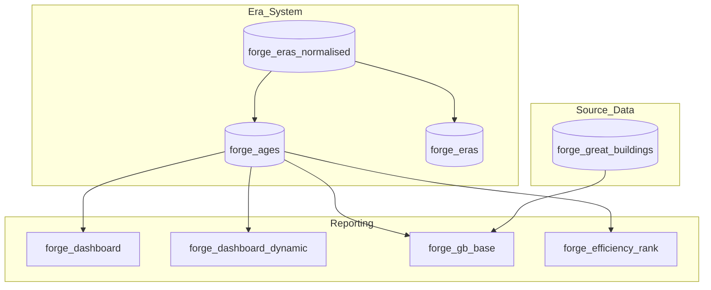

**Overview**

```mermaid
flowchart TD

subgraph Era_System
    A[(forge_eras_normalised)]
    B[(forge_ages)]
    C[(forge_eras)]
end

subgraph Reporting
    D[forge_dashboard]
    E[forge_dashboard_dynamic]
    F[forge_gb_base]
    G[forge_efficiency_rank]
end

subgraph Source_Data
    H[(forge_great_buildings)]
end

A --> B
A --> C

B --> D
B --> E
B --> F
B --> G

H --> F
```
