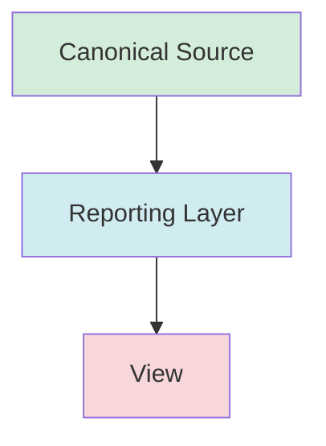

# Test

```mermaid

flowchart TD

A[Canonical Source]
B[Reporting Layer]
C[View]

A --> B
B --> C

classDef source fill:#d4edda
classDef report fill:#d1ecf1
classDef view fill:#f8d7da

class A source
class B report
class C view
```
