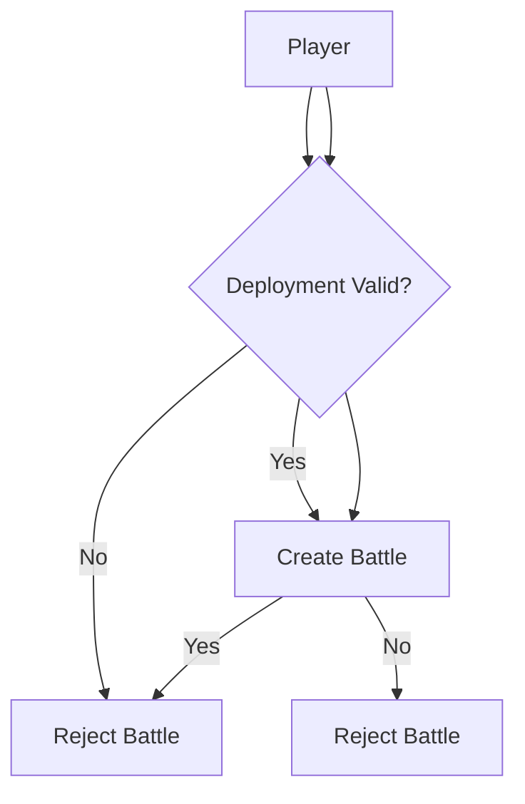

START

```mermaid

flowchart TD

A[Player Selects Army]

A --> B[Load Troop Deployment]

B --> C{Deployment Valid?}

C -->|Yes| D[Create Battle]

C -->|No| E[Reject Battle]

A[Player]
A --> B{Deployment Valid?}

B -->|Yes| C[Create Battle]
B -->|No| D[Reject Battle]


```
